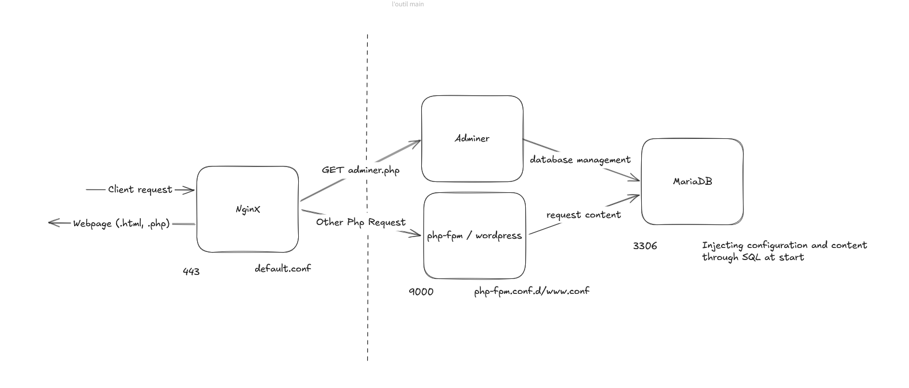

# Inception

This repository contains the Inception project, a comprehensive Docker-based environment for web development, focusing on setting up a robust web stack including Nginx, WordPress, MariaDB, and various supporting services.

## Project Overview

Inception aims to provide a self-contained, reproducible development environment using Docker. It focuses on essential components for modern web applications, emphasizing security and efficient resource management.

## Features

*   **Containerized Nginx:** A secure Nginx container configured with TLSv1.2 or TLSv1.3, acting as the primary entry point for the web stack on port 443.
*   **WordPress & PHP-FPM Integration:** Seamless integration of WordPress with PHP-FPM for dynamic content delivery.
*   **MariaDB Database:** A robust MariaDB container with support for multiple database users.
*   **Volume Management:**
    *   A dedicated volume for website data, shared between WordPress and Nginx containers.
    *   A separate volume for database persistence, allowing for data export and import.
*   **Service Linking:** Efficient inter-container communication using Docker's network capabilities. (no link allowed in requirements)
*   **Bonus Services:** Includes optional bonus services like Adminer and Redis.
*   **Docker Compose Orchestration:** Simplified deployment and management of the entire stack using `docker-compose`.

## Installation 

This project utilizes Docker and Docker Compose for deployment. Ensure you have Docker and Docker Compose installed on your system.

1.  **Clone the Repository:**
    ```bash
    git clone https://github.com/iguidado/Inception.git
    cd Inception
    ```

2.  **Set Up Docker Environment:**
    The `setup_docker.sh` script assists in preparing the necessary Docker environment on Debian ONLY !
    ```bash
    chmod +x setup_docker.sh
    ./setup_docker.sh
    ```
    *Note: This script require sudo access and operating on Debian due to install of docker environment hardcoded*

3.  **Configure Environment Variables:**
    Template of environment variables is located in `srcs/.env.example`. You can generate a generic version using `script/env_templating.sh`


4.  **Build and Run Docker Containers:**
    Use Docker Compose to build the images and start the services.
    ```bash
    docker compose up -d
    ```
    This command will download necessary images, build custom ones if needed, and start all defined services in detached mode.

## Usage

Once the Docker containers are running, you can access the services:

*   **Nginx:** Accessible via `https://localhost` (or the configured domain) on port 443.
*   **WordPress:** Access the WordPress admin panel and frontend through the Nginx entry point.
*   **MariaDB:** Connect to the MariaDB instance using the credentials defined in your Docker Compose configuration or `.env` files.
*   **Adminer (Bonus):** Adminer will be accessible via its designated port, providing a web-based database management interface.

**Example: Accessing WordPress**

After the containers are up, you can directly access installed wordpress website. Credentials used will be defined by DB\_ADMIN\* environnement variable. 

**Example: Connecting to MariaDB (from another container or locally)**

`root` user is configured to access mariadb locally using `MARIADB_ROOT_PASS` .env variable.
You can access db from other container using `DB_ADMIN*` credentials.


```bash
# Example using docker exec to run a mysql client inside the mariadb container
docker exec -it mariadb mysql -u your_db_user -p DB_NAME
```
*Replace `inception_mariadb_1`, `your_db_user`, and `your_database_name` with your actual container name and credentials.*

## Stack architecture


